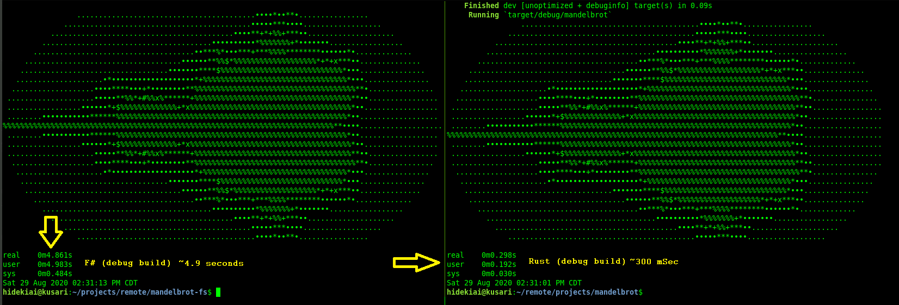

# mandelbrot-fs
F# training, first self-interested project to learn F#; porting of Rust book (Manning Publishing) mandelbrot to F#

First self-project to learn F#, decided to be based off of something already
done and understood, thus it will be quick and only need to concentrate more on
learning the language rather than scratching my head figuring out formulas and
approaches.

## Summary:
* project that can be written quick yet "fun" for learning F#
* *
*
* ## What have I learned:
* * Rust version (see screenshot) takes only 300mSec, while F# version takes
approximately 5 seconds.  Significant difference
* Rust is imeperitive language, you can opt out of loops while F# cannot
bail out immediately, so it's O(N)

## Todo:
* optimize
* *
*
* ## Running and Tests
* * `dotnet run`
*
*
* 
*
*
*
